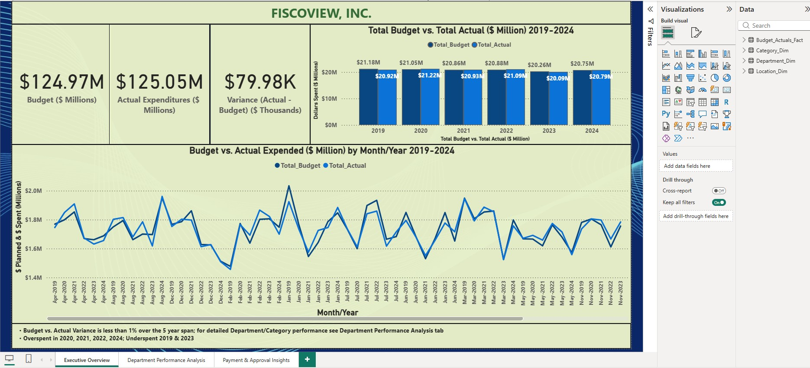
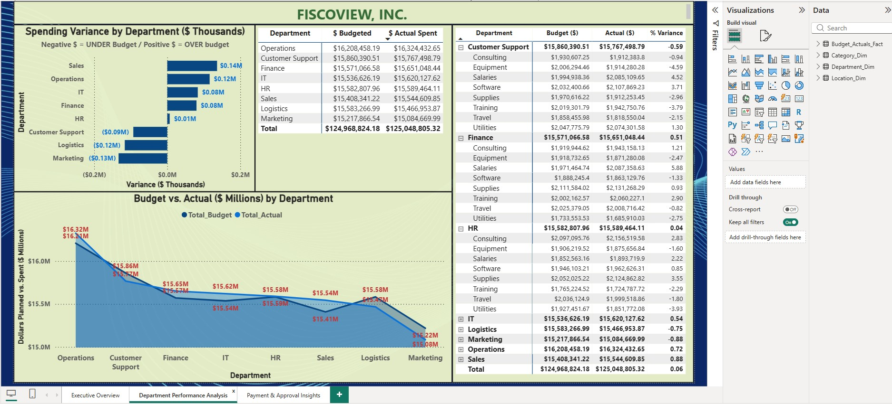
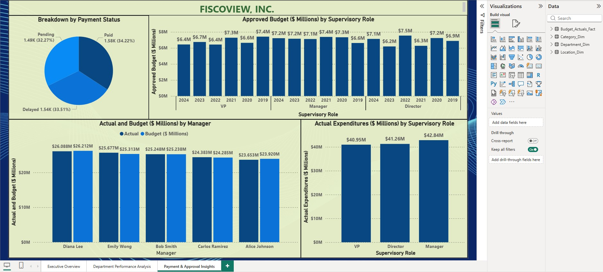
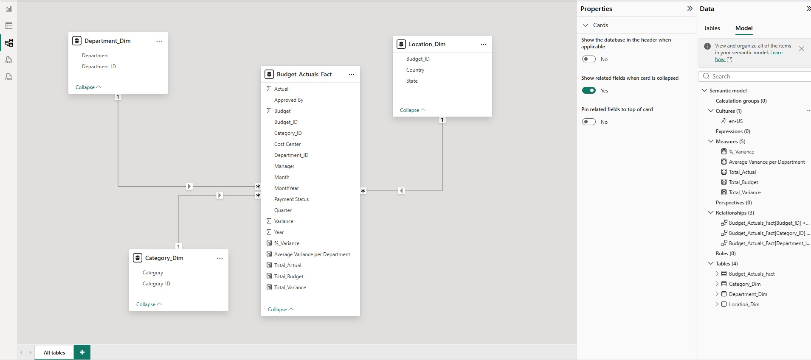

# Fiscoview Budget Performance Analysis

## Project Overview
Using monthly budget and actual financials for the past year, segmented by department and expense category, the data analysis will provide insights to company executives by:
- Providing understanding how departments performed against the budget.
- Identifying areas with significant overspending or underspending.
- Comparing performance over time.
- Drilling down by departments, expense categories, and months.

## Dashboard Preview

## Key Insights
- **Insight 1: Over the period from 2019-2024, the total variance of actual from budget is $80K.
- **Insight 2: Over the same period, 5 departments overspent: Sales, Operations, IT, Finance, and HR.

## How to View
1. Download the `Budget_Performance_Analysis_DB.pbix` file located inside the "Data_Files" folder
2. Open with [Power BI Desktop](https://www.microsoft.com/en-us/download/details.aspx?id=58494).